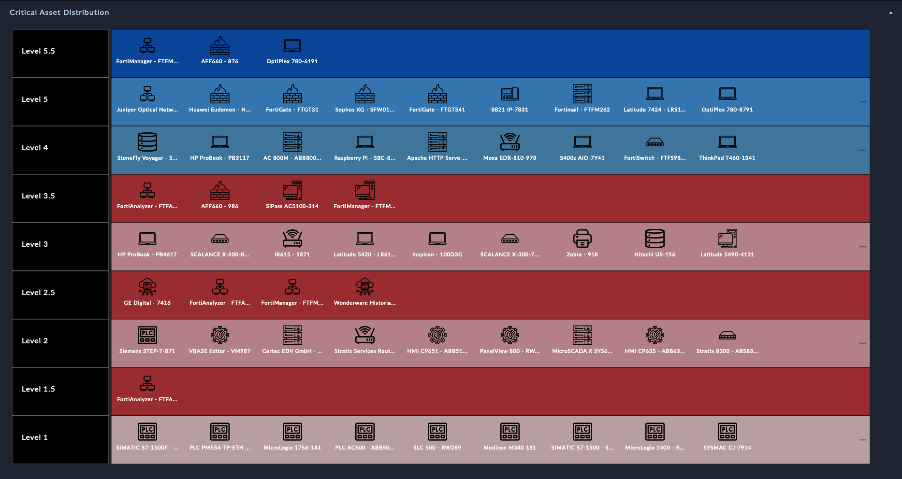

# Release Information

- **Version**: 2.0.0
- **Certified**: Yes
- **Publisher**: Fortinet
- **Compatible Version**: Minimum compatible FortiSOAR v7.4.1
- [Release Notes](./release_notes.md)

# Overview

*Introducing FortiSOAR&trade;'s **OT Asset Management** Solution Pack: Streamline Your Threat Response with Enhanced Visibility!*

As the cybersecurity landscape evolves, industrial control systems (ICS) are becoming increasingly vulnerable to sophisticated threats. FortiSOAR&trade;'s **OT Asset Management** Solution Pack is the cutting-edge tool designed to empower security operations teams in the battle against cyber threats targeting critical infrastructure. With a focus on the Purdue model for ICS security, this comprehensive pack collects all relevant alerts in one centralized platform while providing crucial insights into your assets' Purdue levels.

**OT Asset Management** solution pack is a comprehensive and integrated solution designed to streamline asset threat response processes across your entire organization. Whether it's the critical equipment on your factory floor or the network infrastructure powering your IT systems, this solution pack covers it all! We understand the unique challenges faced by companies in handling threats to assets from both the OT and IT domains, and we have tailored our solution to cater to your specific needs.

**Gain Complete Alert Visibility**:

No more scattered alerts and missed threats. Our solution pack collects and consolidates all cybersecurity-related alerts in one place. With a centralized dashboard, you can easily track, manage, and respond to potential threats promptly.

**Unlock the Power of the Purdue Model**:

The Purdue model is a fundamental framework for ICS security, providing a structured approach to network segmentation and safeguarding operational technology (OT). FortiSOAR's OT Asset Management Solution Pack allows you to identify assets' Purdue levels, enabling you to prioritize your threat response based on criticality and potential impact.

**Enhanced Asset Ingestion**:

Our solution pack offers comprehensive asset ingestion capabilities, capturing essential information such as criticality, asset's zone, category by vendor and product, asset's level and state (active/inactive), and categorization based on Most Essential Function. Additionally, you can mark assets as Most Essential Function with reasons, further enhancing your asset management process.

**Seamless Alert Correlation**:

By correlating alerts with assets, you can quickly determine the affected assets and their associated risks. Visualize the correlations through an intuitive alert correlation graph, facilitating a more efficient and accurate response.

**Comprehensive Enrichment Information**:

For a more in-depth understanding of each asset's criticality, our solution pack enriches asset information with data such as MITRE ATT&CK Matrices and ICS advisories containing CVE IDs. Stay informed and equipped to make informed decisions to protect your infrastructure.

Asset threat response is not just about tracking items; it's about optimizing performance, reducing costs, and maximizing returns. With our **OT Asset Management** solution pack, you'll experience unparalleled benefits:

- Single source of truth for cybersecurity-related alerts from OT and IT domains.
- Reduced asset-related risks and downtime with enhanced information related to asset-criticality.
- Improved compliance with industry regulations.
- Enhanced decision-making based on data-driven insights.
- Increased overall productivity and efficiency.

With the visibility associating Purdue Levels with critical assets, a single pane of glass helps you view all the assets and their criticality as shown in the following figure:

Don't let your assets become a liability. Embrace the power of **OT Asset Management** and take charge of your organizational assets like never before.

Are you ready to unlock the full potential of your assets? Download this solution pack and see firsthand how **OT Asset Management** can transform your business!

# Next Steps

| [Installation](./docs/setup.md#installation) | [Configuration](./docs/setup.md#configuration) | [Usage](./docs/usage.md) | [Contents](./docs/contents.md) |
|----------------------------------------------|------------------------------------------------|--------------------------|--------------------------------|