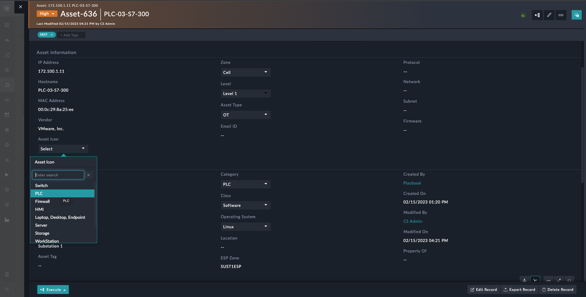
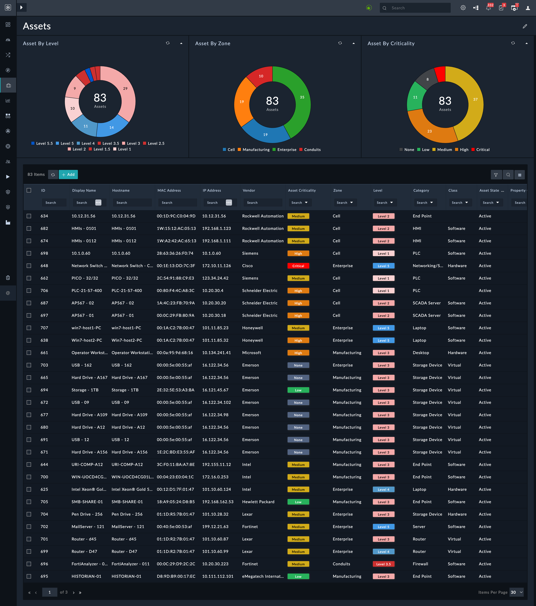
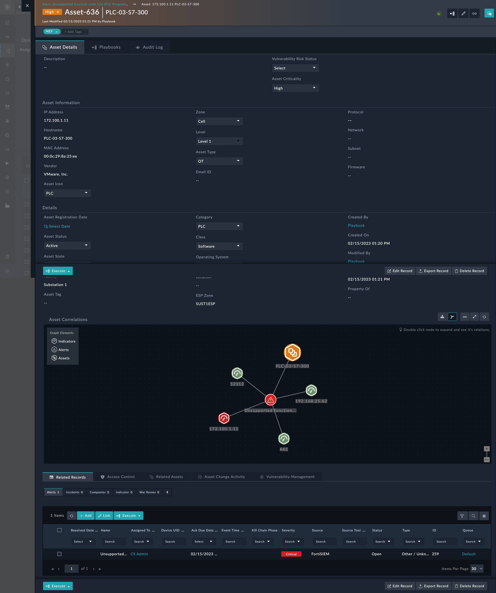
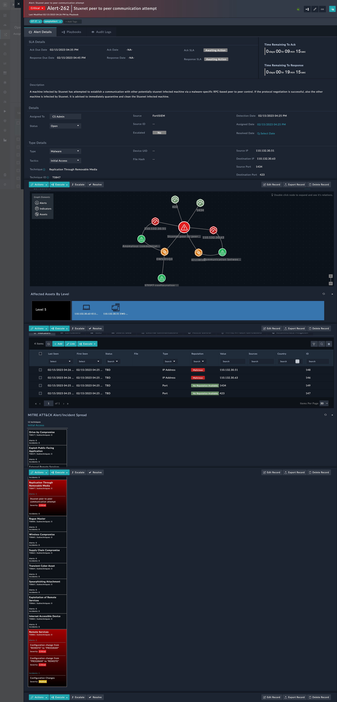
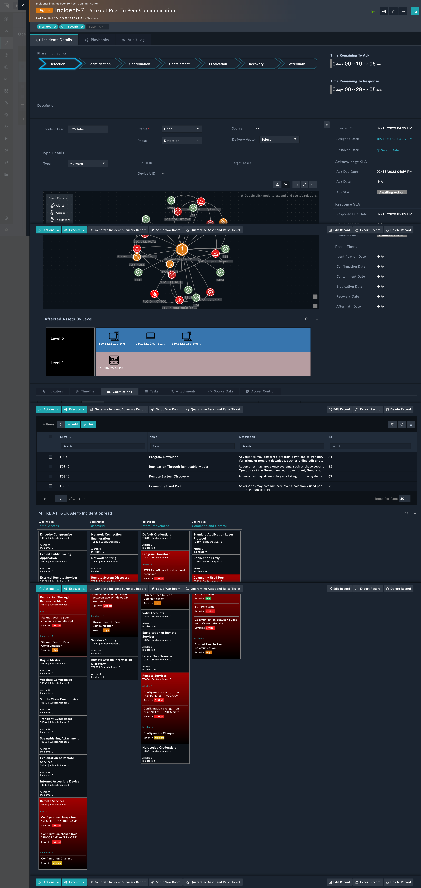

| [Home](../README.md) |
|--------------------------------------------|

# Usage

Refer to [Simulate Scenario documentation](https://github.com/fortinet-fortisoar/solution-pack-soc-simulator/blob/develop/docs/usage.md) to understand how to simulate and reset scenarios.

To understand the process FortiSOAR follows to respond to **Asset Management**, **Baseline changes over assets** and **Alerts over Assets**, we have included a scenario &mdash; `OT - Add Sample Assets`, `OT - Add Sample Alerts`, `OT - Stuxnet Attack Scenario` and `OT - Asset Change Activity` with this solution pack. 

Refer to the section `OT - Asset Management` to understand how this solution pack automation addresses your needs.

# OT- Asset Management

### Steps to be followed after installing SP:

1. Use Playbook - **MITRE ATT&CK > Fetch Latest Data** on ICS Configuration of MITRE Connector from Playbook Collection - `00 - Use Case - Asset Management`  to get the Tactics, Techniques, Sub-techniques, Mitigations, Groups and Software.

> Note: On alert creation, IOCs get enriched, and the alert get correlated with Techniques, Mitigation, and all other records for the MITRE ATT&CK Id available in the alert.

## Simulation mode

The simulation mode has some sample data that helps you get a better understanding of how the solution pack functions. Following steps help you use the solution pack with some included sample data.

> **1. OT - Add Sample Assets**
- Browse to `Simulations` > `OT - Add Sample Assets` scenario and click **Simulate Scenario**.
- This scenario adds 83 different sample OT Assets (different Levels, Types etc.) for testing dashboards, use case playbooks, reports and other actions. 
***NOTE***: Ensure you run this 'OT - Add Sample Assets' Scenario prior to running the 'OT - Add Sample Alerts', for facilitating the correlations of Alerts and Asset records.

> **2. OT - Add Sample Alerts**
- Browse to `Simulations` > `OT - Add Sample Alerts` scenario and click **Simulate Scenario**.
- This scenario adds 12 well populated sample OT Alerts for testing dashboards, use case playbooks, reports and other actions. 
***NOTE***: Ensure you run the 'OT - Add Sample Assets' Scenario prior to this, for facilitating the correlations of Alerts and Asset records.

> **3. OT - Stuxnet Attack Scenario**
- Make sure the global variable **Demo mode** is set to `true`. 
- Browse to `Simulations` > `OT - Stuxnet Attack Scenario` scenario and click **Simulate Scenario**.
- Four Alerts get created each at an interval of 2 seconds:
    - Stuxnet peer to peer communication attempt
    - Anomalous communication between two Windows XP machines
    - Communication between public and private networks
    - STEP7 configuration download command
- If an asset does not already exist, it is created and added to the record with the following hostname:
    - PLC-04-S7-400
    - EWS-42E6
    - IE11Win7
    - EWS-01Q3
- Each alert get associated with assets based on the Source and Destination IP.
- **Technique**, **Sub-Technique** and **Software** get linked to alerts under the **MITRE ATT&CK Correlations** tab.
- **Mitigation** comes under the **Recommended Mitigation** tab.
- Once the alert has been enriched, open the "Stuxnet peer to peer communication attempt" alert and look for a similar alert in the Workspace `Recommendations` tab. 
- Escalate the alert to an incident by checking "Select All" and "Include this record," then running the playbook **Escalate To Incident**. Please provide all incident details. (An incident is created with the link available in the alert's comment)
- Incident get correlated with all the IOCs, Alerts, Assets, Technique, Mitigation and Software.
- Click on **Quarantine Asset and Raise Ticket** to quarantine assets and raise ticket for assets.
- You can generate report by using **Generate Incident Summary Report**
- Use the "Setup War Room" button to create a war room. All of the alerts, incidents, affected assets, and artefacts will be in the war room.
- Playbooks in the War Room can be used to take action, such as `Isolate Devices From Network`, `Scan All Assets Involved`, and `Update Firewall Policy`.

> **4. OT - Add Sample Asset Change Activity Record**
- Browse to `Simulations` > `OT - Add Sample Asset Change Activity Record` scenario and click **Simulate Scenario**.
- Playbook: **Scenario - OT - Asset Change Activity** has two variables `dueDays` and `mediumImpactAsset`. You can populate these variables with your preferred values in the *Configuration* step. 
    - `dueDays` - Days required to complete change activity.
    - `mediumImpactAsset` - Impacted Asset hostname.
- With a given value of due date in `dueDays` two Asset Change Activity entries are made.
    - Add New Cyber Asset - Intel Core i7-13700K (Asset) 
    - Medium Impact Baseline Change - Patch For log 4J
- If an asset does not already exist, it is created and added to the record with the following hostname:
    - Intel Core i7-13700K
- Assets are linked and can be seen in the Assets & Vulnerabilities tab.
- Once the record has been created, execute the **Add Task From Templates** to assign different tasks to different people. 
- New tasks get created once the previous task is completed.
- New task can be added by using **Add New Task** playbook.
- Once all task get completed record get closed.
- To generate the report, execute **Generate Compliance Report** and report get attached to particular record comments.

## Aseets Icon
- As illustrated in figure, you can change the Assets Icon by selecting it from the available Icons in the Asset Resources Record.

> **Note**: List or detail views of the various modules are mentioned below.
- `Asset`: Please download this zip file and import it into your instance if you want to update the [List View](./res/Asset_List_View.zip) List View and [Details View](./res/Asset_Detail_View.zip) of Assets to what is shown below.

|  |  |
|:----------------------------------:|:-------------------------------------:|
| Aseet List View | Asset Detail View |

- `Alert`: Please download this zip file and import it into your instance if you want to update the [Details View](./res/Alert_Detail_View.zip) of Alert to what is shown below.

|  |
|:----------------------------------:|
| Alert Detail View |

- `Incident`: Please download this zip file and import it into your instance if you want to update the [Details View](./res/Incident_Detail_View.zip) of Incident to what is shown below.

|  |
|:----------------------------------:|
| Incident Detail View |