| [Home](../README.md) |
| -------------------- |

# Usage

To understand the process FortiSOAR&trade; follows to respond to **Asset Management**, **Baseline changes over assets**, and **Alerts over Assets**, we have included following scenarios with this solution pack:

- [OT - Add Sample Assets](#ot---add-sample-assets)

- [OT - Add Sample Alerts](#ot---add-sample-alerts)

- [OT - Stuxnet Attack Scenario](#ot---stuxnet-attack-scenario)

- [OT - Asset Change Activity Scenario](#ot---asset-change-activity-scenario)

Refer to the subsequent sections to understand how this solution pack's automation addresses your needs.

<table>
    <tr>
        <td><strong>IMPORTANT</strong></td>
        <td>For seamless execution of included scenarios, set the global variable <code>Demo mode</code> to <code>true</code>.</td>
    </tr>
</table>

Refer to [Simulate Scenario documentation](https://github.com/fortinet-fortisoar/solution-pack-soc-simulator/blob/develop/docs/usage.md) to understand how to simulate and reset scenarios.

## OT - Add Sample Assets

This scenario generates 87 IT/OT assets as per the Purdue model based on various criticality levels, types, and other asset categorizations as sample data.

To run this scenario and generate the assets, perform the following steps:

1. Under the FortiSOAR&trade;'s left navigation panel, select to open **Simulations**.

2. Select the scenario **OT - Add Sample Assets**.

3. Click **Simulate Scenario**.

4. To view the added sample assets, hover over **Resources** under the FortiSOAR&trade;'s left navigation panel, and select **Assets**.

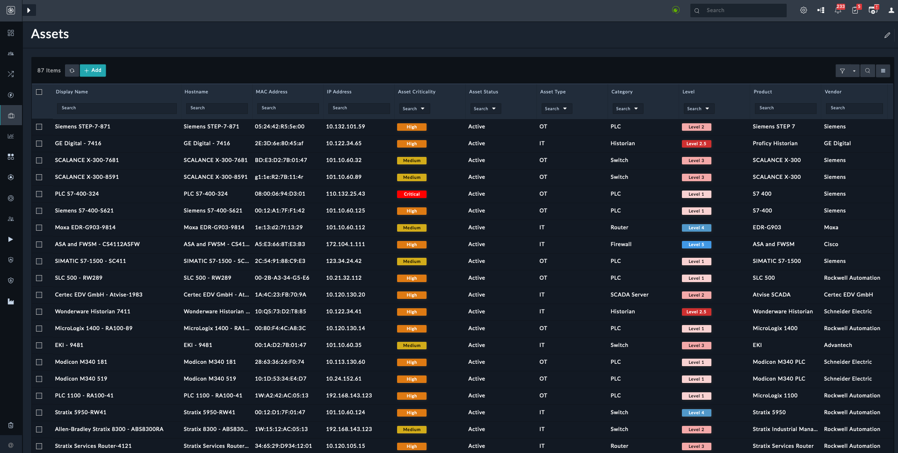

## OT - Add Sample Alerts

This scenario generates 12 well-populated alerts associated with assets, generated in the [OT - Add Sample Assets](#ot---add-sample-assets) scenario, as sample data.

To run this scenario and generate the alerts, perform the following steps:

1. Under the FortiSOAR&trade;'s left navigation panel, select to open **Simulations**.

2. Select the scenario **OT - Add Sample Alerts**.

3. Click **Simulate Scenario**.

4. To view the added sample alerts, hover over **Incident Response** under the FortiSOAR&trade;'s left navigation panel, and select **Alerts**.

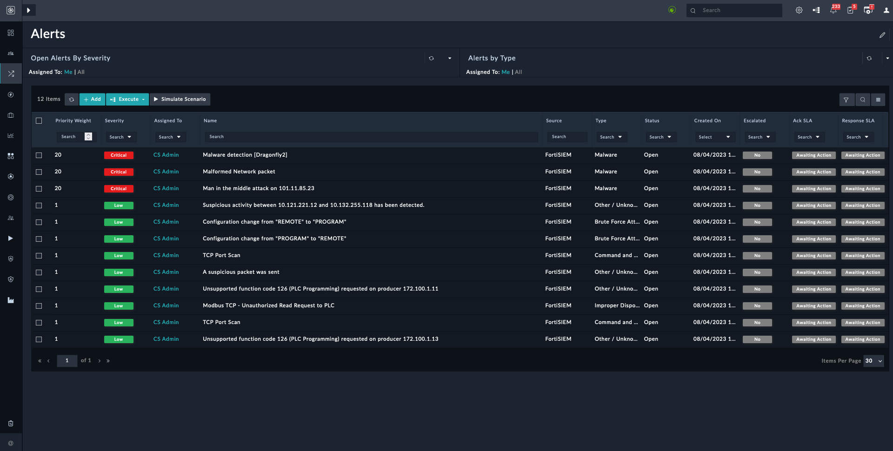

## OT - Stuxnet Attack Scenario

Stuxnet Attack Scenario demonstrates the *Stuxnet Incident* to observe how FortiSOAR&trade; behaves when encountering a real cyber attack. Although Stuxnet is a dated piece of malware, it represents the complexity of real targeted attacks and is infamous for many reasons.

This scenario generates following alerts, each at an interval of 2 seconds:

- Stuxnet peer-to-peer communication attempt
- Anomalous communication between two Windows XP machines
- Communication between public and private networks
- STEP7 configuration download command

To run this scenario and generate the alerts, perform the following steps:

1. Under the FortiSOAR&trade;'s left navigation panel, select to open **Simulations**.

2. Select the scenario **OT - Stuxnet Attack**.

3. Click **Simulate Scenario**.

4. To view the added sample alerts, hover over **Incident Response** under the FortiSOAR&trade;'s left navigation panel, and select **Alerts**.

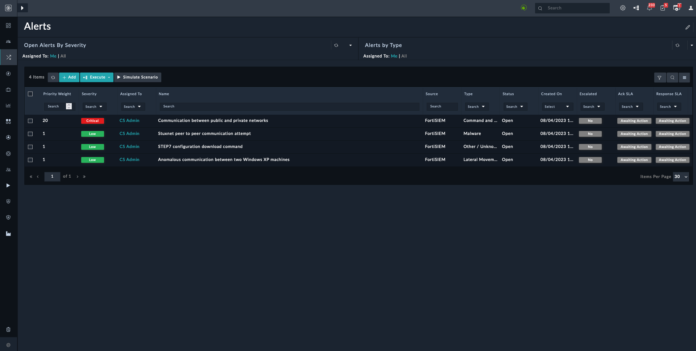

### Enrichment

- Each alert is linked to the following assets based on their source and destination IP:

    - PLC S7-400-324
    - Dell - 5490-42E6
    - ThinkCentre M910s-1181
    - HP - PB7181

    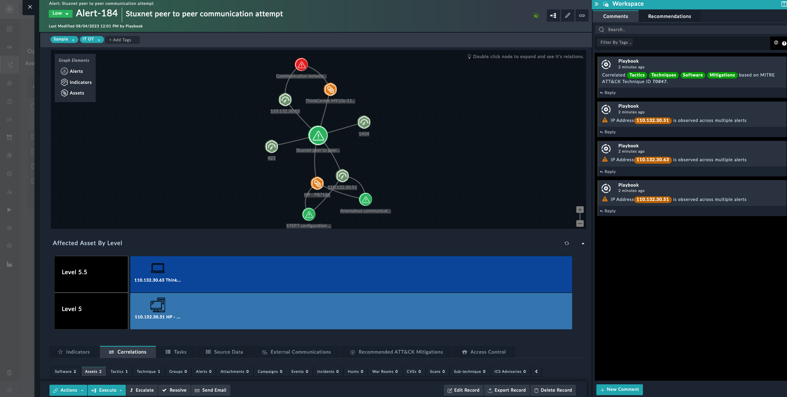

- The *Technique ID* in an alert ensures linking of MITRE ATT&CK's data &ndash; *Group*, *Tactics*, *Technique*, *Sub-Technique*, and *Software*. This data appears under the alert's **Correlations** tab.

    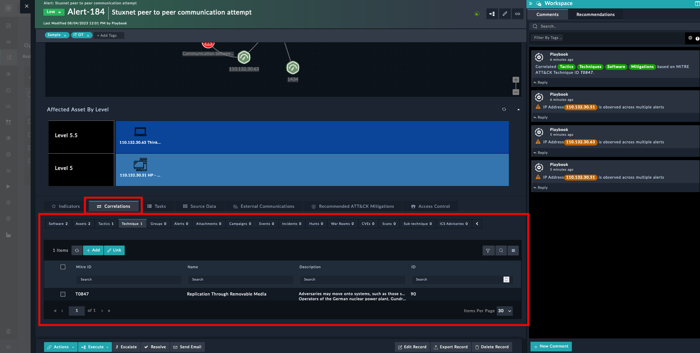

- Mitre ATT&CK's suggested *Mitigations* are fetched using the *Technique ID* and are listed under the alert's **Recommended ATT&CK Mitigations** tab.

    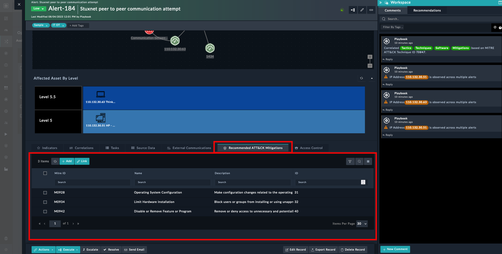

<table>
    <tr>
        <td><strong>TIP</strong></td>
        <td>The <strong>Workspace</strong> panel lists alerts similar to <strong>Stuxnet peer-to-peer communication attempt</strong>. To know more about the Workspace panel refer to the platform documentation at <a href="https://docs.fortinet.com/document/fortisoar/7.4.1/user-guide/841633/war-rooms#Workspace_-_Enabling_Communication">Workspace - Enabling Communication</a>.</td>
    </tr>
</table>

### Recommended Actions for Alerts

1. You can escalate these alerts to an incident from an alert's *Workspace* panel.

    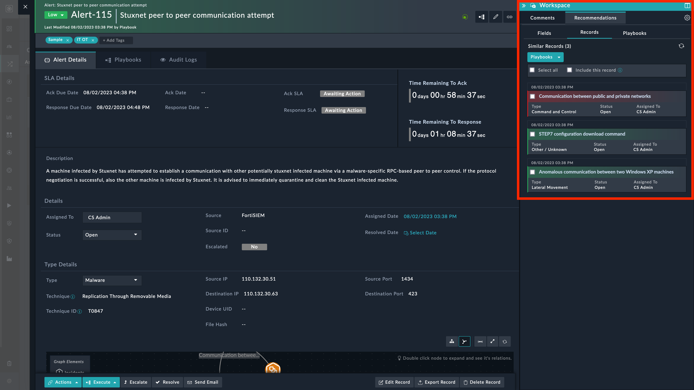

2. Navigate to the **Records** tab:

    1. Select **Select All** and **Include this record** checkboxes.
    2. Click the **Playbook** drop-down.
    3. Select **Escalate**.

3. On the **Escalate** pop-up window, enter relevant details and click the button **Escalate**.

4. Navigate to the **Comments** tab under the *Workspace* panel to view the link referencing the newly-created incident.

5. Click the link in the alert's comment to open the incident. The incident opens in a new browser tab.

### Recommended Actions for Incidents

Incidents are correlated with all the IOCs (under *Indicators*), *Alerts*, *Assets*, MITRE ATT&CK's *Group*, *Tactics*, *Technique*, *Sub-techniques*, *Software*, and *Mitigation*.

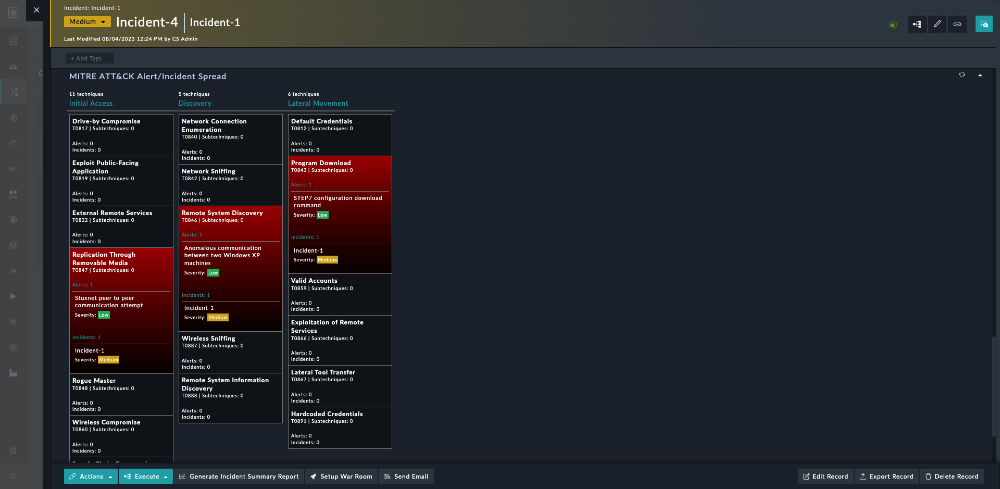

1. Click the button **Execute** on the incident's screen.

2. Select the **Quarantine Asset and Raise Ticket** playbook, under *Execute*, to run it.

3. Click **Quarantine Assets**, after reviewing the listed assets, on the modal that appears. This action quarantines the listed assets and raises a ticket.

    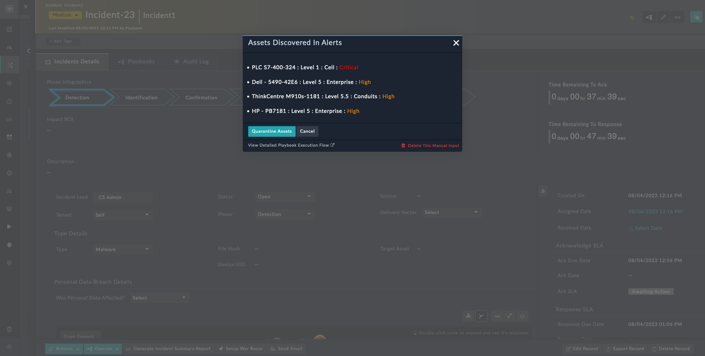

    <table>
        <tr>
            <td><strong>NOTE</strong></td>
            <td>This playbook quarantines the asset on <em>Fortinet FortiEDR</em> and raises a ticket on <em>ServiceNow</em> for further action.
            You can also integrate your preferred EDR and ticketing solutions.</td>
        </tr>
    </table>

4. You can generate report by using **Generate Incident Summary Report** button.

5. Use the **Setup War Room** button to create a war room.

6. Click the link in the incident's comment to open the war room. The war room opens in a new browser tab.

### Recommended Actions for War Room

The war room lists the incident from where it was created. Along with the incident it also lists associated alerts, affected assets, and IOCs (Indicators of Compromise).

Following playbooks can be run to simulate actual actions that can be performed using FortiSOAR&trade; playbooks:

- *Isolate Devices From Network*
- *Scan All Assets Involved*
- *Update Firewall Policy*.

## OT - Asset Change Activity Scenario

This scenario generates sample *Asset Change Activity* records as follows:

| Type                          | Asset Name          | Record Title                                      |
|:------------------------------|:--------------------|:--------------------------------------------------|
| Add Cyber Asset               | Siemens S7-400-S621 | Add Cyber Asset - Siemens S7-400-S621             |
| Medium Impact Baseline Change | Stratix 5950-RW41   | Medium Impact Baseline Change - Stratix 5950-RW41 |

These sample records demonstrate the process of conducting an *Asset Change Activity* for an asset. The sample Asset Change Activity records have a tag, `Sample`, for easy identification.

To run this scenario and generate the assets, perform the following steps:

1. Under the FortiSOAR&trade;'s left navigation panel, select to open **Simulations**.

2. Select the scenario **OT - Asset Change Activity Scenario**.

3. Click **Simulate Scenario**.

    <table>
        <tr>
            <td><strong>NOTE</strong></td>
            <td><strong>Scenario - OT - Asset Change Activity</strong> has a variable <code>dueDays</code> (<em>Days required to complete change activity</em>). You can populate this variable with your preferred value in the <em>Configuration</em> step.</td>
        </tr>
    </table>

4. Under the FortiSOAR&trade;'s left navigation panel, select to open **Resources** > **Asset Change Activities**.

    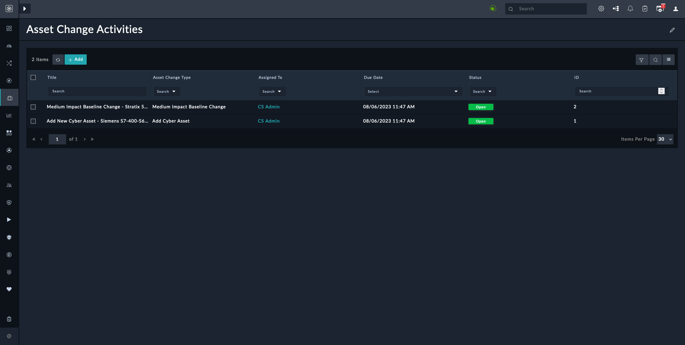

5. Open any of the following activities listed.

    - Add Cyber Asset

    - Medium Impact Baseline Change

    <table>
        <tr>
            <td><strong>NOTE</strong></td>
            <td>For purposes of this documentation, we have selected the <strong>Medium Impact Baseline Change - Stratix 5950-RW4</strong> activity.</td>
        </tr>
    </table>

    The **Assets & Vulnerabilities** tab in the *Medium Impact Baseline Change - Stratix 5950-RW4* activity lists the linked assets.

### Recommended Actions for Asset Change Activity

1. Click the **Add Task From Templates** button to launch **Specify Assignees and Approvers for Tasks** modal.

    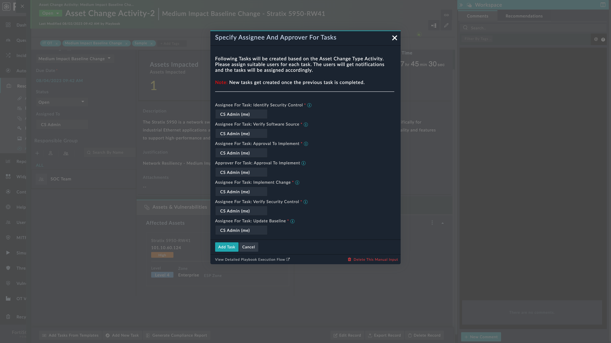

2. Fill in the assignees and approver information.

3. Click **Add Task** button to add this task. This creates a new task with priority *Medium* under the **Task Management** tab.

4. Select the **Task Management** tab to open the task management board.

    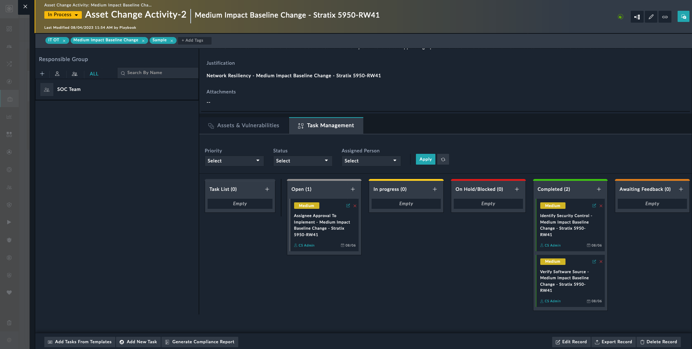

5. Edit the open task and mark the status as completed. This moves the task to the *Completed* bucket and creates another task with priority *Medium* under the *Open* bucket. This process repeats until all tasks are moved to *Completed* bucket.

<table>
    <tr>
        <td><strong>TIP</strong></td>
        <td>To add new tasks, click the <strong>Add New Task</strong> button.</td>
    </tr>
</table>

The record **Medium Impact Baseline Change - Stratix 5950-RW4** closes once all tasks are completed.

To generate the report, click **Generate Compliance Report** button. The report is attached to the comment, under the *Workspace* panel, associated with that record.

| [Installation](./setup.md#installation) | [Configuration](./setup.md#configuration) | [Contents](./contents.md) |
|-----------------------------------------|-------------------------------------------|---------------------------|